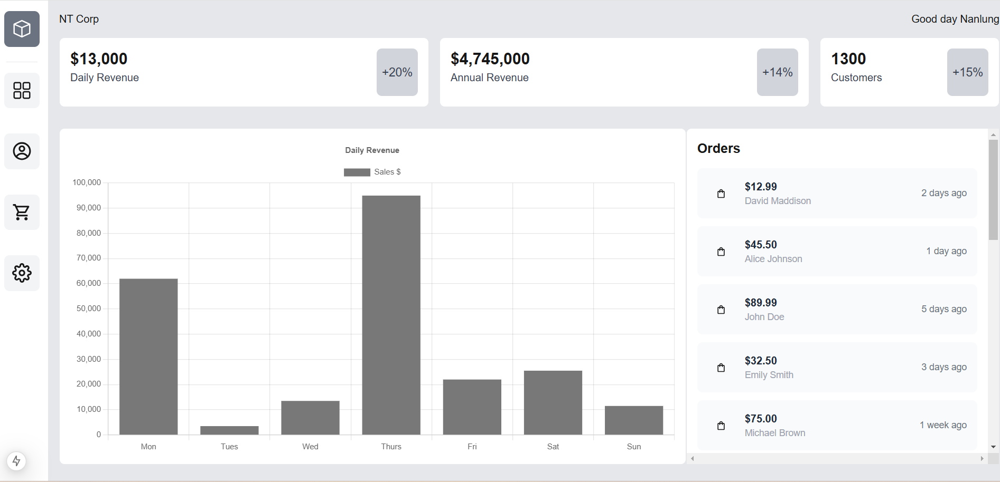
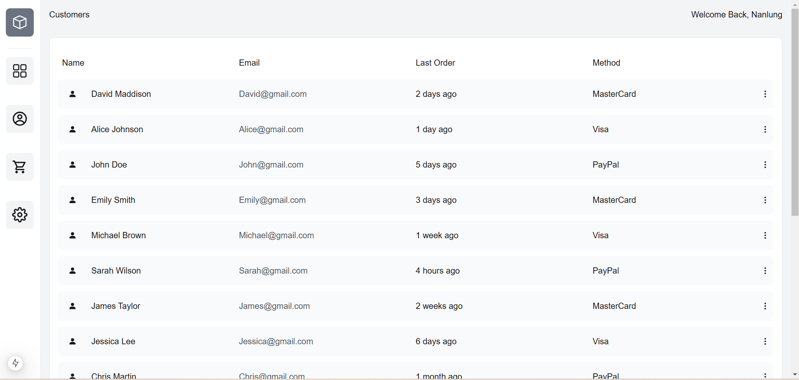
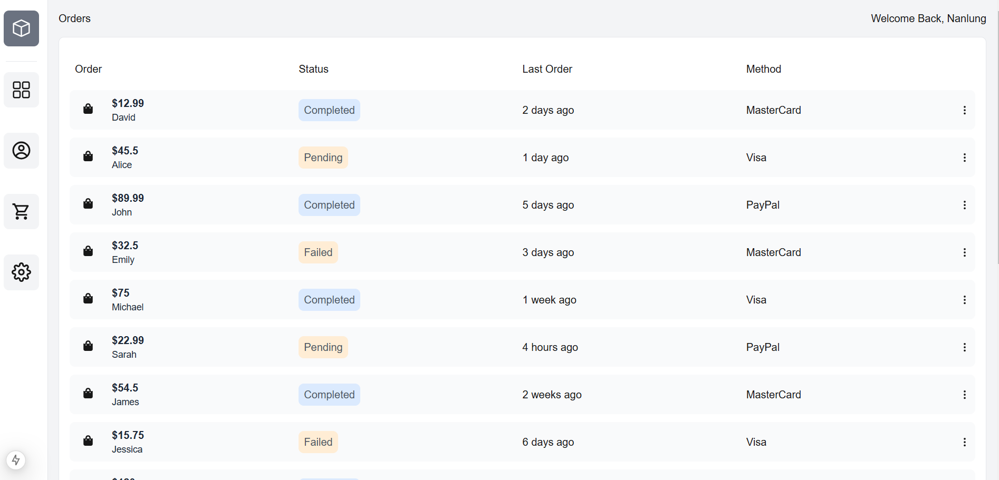

# NT Corp Admin Dashboard

Welcome to the **NT Corp Admin Dashboard** project! This dashboard is designed to provide administrators with an intuitive interface to manage and visualize data effectively. Built using modern web development technologies, it ensures optimal performance and a responsive design.

---

## 🚀 Features

- **User-friendly Interface**: Designed with Tailwind CSS for a clean and responsive layout.
- **Interactive Charts**: Visualize data dynamically using Chart.js.
- **Performance Optimized**: Built with Next.js for server-side rendering and fast page loads.
- **Customizable**: Modular and scalable code structure.

---

## 🛠️ Tech Stack

- **Framework**: [Next.js](https://nextjs.org/) (React-based framework for server-side rendering and static site generation)
- **Styling**: [Tailwind CSS](https://tailwindcss.com/) (utility-first CSS framework)
- **Data Visualization**: [Chart.js](https://www.chartjs.org/) (JavaScript charting library)

## 🖥️ Setup and Installation

1. **Clone the Repository**:

   ```bash
   git clone https://github.com/nanlung/ntcorp-admin-dashboard.git
   cd dashboard
   ```

2. **Install Dependencies**:

   ```bash
   npm install
   ```

3. **Run the Development Server**:

   ```bash
   npm run dev
   ```

   Open [http://localhost:3000](http://localhost:3000) in your browser to see the dashboard in action.

4. **Build for Production**:

   ```bash
   npm run build
   npm start
   ```

---

## 📊 Working with Charts

The project uses Chart.js for data visualization. Customize your charts in the relevant components inside the `src/components/charts/` directory. Example configurations can be found in the [Chart.js documentation](https://www.chartjs.org/docs/latest/).

## Deployment

https://nt-corp.vercel.app

## 📸 Screenshots

### Home Page



### Customers Page



### Orders Page


